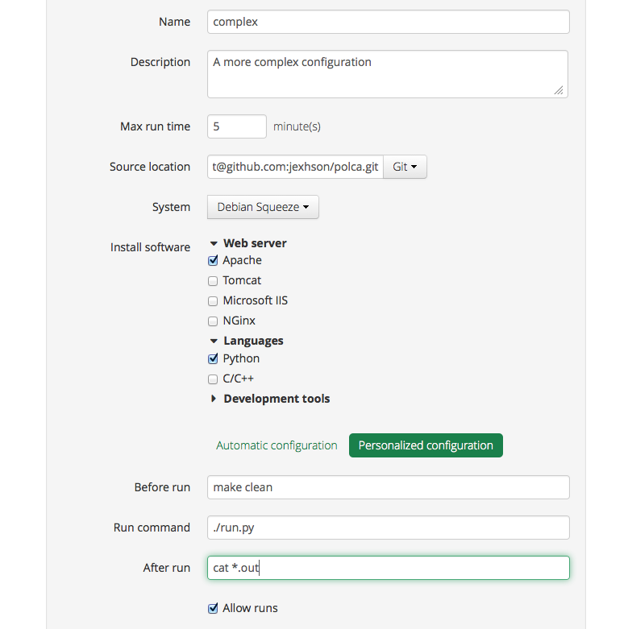
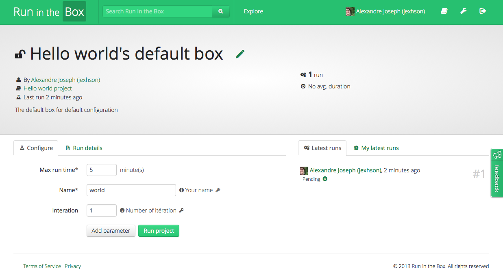

Run, test, share, everywhere
============================

SaaS cloud based environment prototype to build, execute and test application for open source and private projects.

Note: This Django app is no longer developed but some parts might be interesting like the dynamic Django form generation.

Setup execution environment
---------------------------

Configure execution box with your own development environment. There is no lock-in, you are free to use platform and technologies you want.

Define application parameters
-----------------------------

Explain which parameters can be set when running your application. Viewers and contributors will just have to select options they wants in order run you program.

Browse execution output
-----------------------

Disseminate application run results for given parameters. Helpful for scientific experimentations but also for development debugging and testing 

